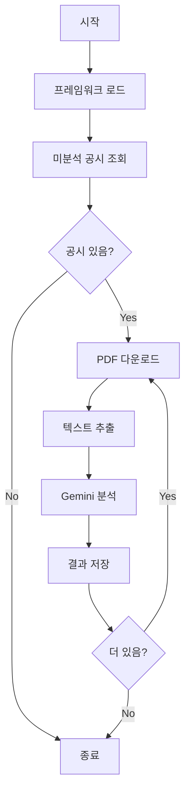

# 밸류업 공시 분석 모듈

## 개요

KRX 밸류업 공시 PDF를 Framework 기반으로 분석하여 Google Sheets에 기록하는 자동화 모듈입니다.

## 주요 기능

1. **공시 조회**: `밸류업공시목록` 시트에서 최근 발행된 미분석 공시 조회
2. **PDF 추출**: KRX에서 PDF 다운로드 및 텍스트 추출
3. **AI 분석**: Gemini API를 활용한 Framework 기반 구조화 분석
4. **결과 저장**: `밸류업공시분석` 시트에 분석 결과 기록

## 분석 프레임워크

`Framework` 시트에 정의된 45개 항목을 기준으로 분석합니다.

### 영역 구조

| 영역 | 카테고리 | 주요 항목 |
|------|----------|-----------|
| A1. 자본효율 | 수익성, 효율성, 밸류에이션, 자본비용 | ROE, ROIC, PBR, WACC |
| A2. 주주환원 | 배당, 자사주, 환원정책 | 배당성향, 자사주매입/소각, TSR |
| A3. 성장투자 | 성장률, 투자, 사업확장 | 매출성장률, CAPEX, R&D |
| A4. 거버넌스 | 이사회, 감사통제, 재무안정, ESG | 이사회독립성, ESG등급 |

### 추출 레벨

- **Level 0**: 해당 항목 언급 없음
- **Level 1**: 정성적 언급 (방향/계획만)
- **Level 2**: 정량적 수치 제시

## 파일 구조

```
01_valueup_analysis/
├── __init__.py           # 패키지 초기화
├── main.py               # 메인 실행 파일
├── gsheet_analyzer.py    # Google Sheets 관리
├── pdf_extractor.py      # PDF 다운로드 및 텍스트 추출
├── gemini_analyzer.py    # Gemini API 분석
└── framework_loader.py   # 프레임워크 로더
```

## 설정

### 환경변수

| 변수명 | 설명 | 필수 |
|--------|------|------|
| `GOOGLE_SERVICE` | 서비스 계정 JSON | ✅ |
| `VALUEUP_GSPREAD_ID` | 스프레드시트 ID | ✅ |
| `GEM_ANALYTIC` | Gemini API 키 | ✅ |
| `ANALYSIS_DAYS` | 분석 기간(일), 기본값: 7 | |
| `ANALYSIS_MAX_ITEMS` | 최대 분석 수, 기본값: 10 | |

### GitHub Secrets

```
GOOGLE_SERVICE       # 서비스 계정 JSON (전체 내용)
VALUEUP_GSPREAD_ID   # 스프레드시트 ID
GEM_ANALYTIC         # Google AI Studio Gemini API 키
```

## 사용법

### 로컬 실행

```bash
# 의존성 설치
pip install -r requirements/requirements_analysis.txt

# 환경변수 설정
export GOOGLE_SERVICE='{"type": "service_account", ...}'
export VALUEUP_GSPREAD_ID='1abc...'
export GEM_ANALYTIC='AIza...'

# 실행
cd 01_valueup_analysis
python main.py

# 옵션
python main.py --days 30          # 최근 30일 분석
python main.py --max-items 5      # 최대 5건만 분석
python main.py --dry-run          # 테스트 모드 (저장 안함)
```

### GitHub Actions

1. **자동 실행**: 매주 일요일 01:00 UTC (월요일 10:00 KST)
2. **수동 실행**: Actions 탭에서 "Run workflow" 클릭

## 출력 시트 구조

### 밸류업공시분석 시트

| 컬럼 | 설명 |
|------|------|
| 접수번호 | 공시 접수번호 |
| 회사명 | 기업명 |
| 종목코드 | 주식 종목코드 |
| 공시일자 | 공시 발표일 |
| 분석일시 | 분석 완료 시각 |
| 분석상태 | completed / error |
| 언급항목수 | 전체 언급 항목 수 |
| Core언급수 | Core 항목 중 언급 수 |
| 주요포인트 | 핵심 내용 요약 |
| I01_level ~ I45_note | 각 항목별 분석 결과 |

### 항목별 필드

각 항목(I01~I45)에 대해 5개 필드가 생성됩니다:

- `{item_id}_level`: 0/1/2 (언급없음/정성적/정량적)
- `{item_id}_current`: 현재 수치
- `{item_id}_target`: 목표 수치
- `{item_id}_year`: 목표 연도
- `{item_id}_note`: 관련 문장 인용

## 워크플로우



## 제한사항

- Gemini API 호출 제한 고려 (2초 딜레이)
- PDF 텍스트 추출 품질에 따라 분석 정확도 변동
- 일부 이미지 기반 PDF는 추출 불가

## 라이선스

MIT License
